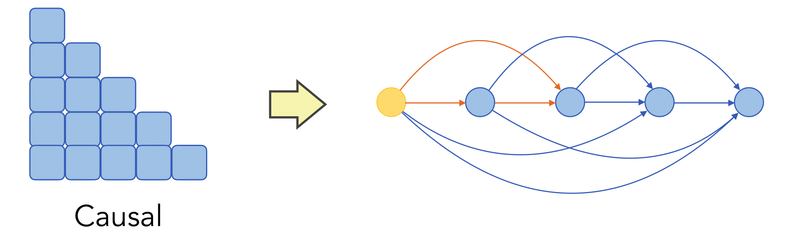

# 🧠 *On the Emergence of Position Bias in Transformers*  
📌 **ICML 2025**  
📄 [Read the Paper](https://arxiv.org/abs/2502.01951)  
👥 [**Xinyi Wu**](https://xinyiwu98.github.io/), [Yifei Wang](https://yifeiwang77.com/), [Stefanie Jegelka](https://people.csail.mit.edu/stefje/), [Ali Jadbabaie](https://jadbabaie.mit.edu/)




### 📦 Install packages

```python
conda create -n pos-bias python=3.9
conda activate pos-bias
pip install -r requirements.txt
```
------

### 🚀 Run experiments

This example trains a 2-layer self-attention network (SAN) with causal masking and no positional encoding (NoPE) on a dataset biased toward the beginning of the sequence.
 
```python

python train.py --mask causal --num_attn_layers 2 --pe no --train_bias --index 0

```

### 🎭 Mask Options 
| Option           | Description                                                                           |
| ---------------- | ------------------------------------------------------------------------------------- |
| `full`           | No masking (fully connected attention across all positions).                          |
| `causal`         | Standard autoregressive causal mask, allowing attention only to previous tokens.      |
| `window` | Local attention with a fixed window size. Use `--window_size` to specify the size of the window.        |
| `prefix`         | Prefix-style mask. Use `--num_prefixes` to specify the number of prefix tokens.


### 🔢 PE Options 
| Option  | Description                                                                     |
| ------- | ------------------------------------------------------------------------------- |
| `no`    | No positional encoding (NoPE).                                                  |
| `sin`   | Standard sinusoidal positional encoding.                                        |
| `rope`  | Rotary positional encoding (RoPE).                          |
| `decay` | Distance-based exponential decay encoding (ALiBi). Use `--gamma` to set decay strength. |


### 🧪🎲 data Options 
| Option  | Description                                                                     |
| ------- | ------------------------------------------------------------------------------- |
| `gaussian`    | Gaussian mixture model. Use `--eps` to specify within class variance.                                                |
| `fixed`   | Fixed vocabulary setting. Use `--lamb` to specify the strength of anisotropy of token embeddings.|


### 💡 Have ideas or feature requests?
I’d love to hear your suggestions! Feel free to open an issue or email me xinyiwu@mit.edu if there's any functionality you'd like to see added or improved.


### 📝 Citation
Thank you for your interest in our work!
Please consider citing
```bibtex
@inproceedings{Wu2025PosBiasinAttn,
  title={On the Emergence of Position Bias in Transformers},
  author={Xinyi Wu and Yifei Wang and Stefanie Jegelka and Ali Jadbabaie},
  booktitle={ICML},
  year={2025}
}
```
